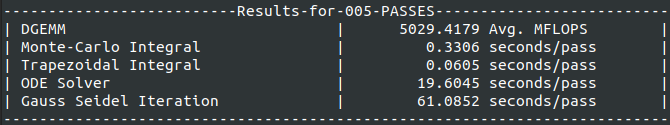
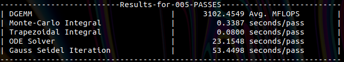

# HPPWB - High Performance Physics Workstation Benchmark

[For a PDF version of this README, run ```pandoc README.md -o README.pdf``` after cloning.]


## What?

HPPWB (High Performance Physics Workstation Benchmark) is an alternative suite for benchmarking workstations with specifically shared-memory architectures (for now).

## Why and How?

While industry standard benchmarks like HPLinpack exist, which is used for making the TOP500 list, and is widely used across domains, such benchmarks use a fixed workload like solving a dense set of linear equations to measure the performance of a system. While that provides a nice standard, it is generally not reflective of real-life performance in variety of workloads.

In specific simulations and workloads which are characterisitic to physics and engineering research, not only do we need to solve linear equations systems (which can be parallelized easily), but also other not-so-parallelizable things like solving ODEs, PDEs and so on. We aim to tackle that problem with this suite - not only are we using solving linear equations as a benchmark but also things like performing integrals using Trapezoidal rule and the Monte-Carlo estimator, solving high-dimensional ODEs and BLAS routines. I aim to add more features and tests in the future along with acclerators and distributed-memory architecture support.

- **Benchmarks currently available:**

| Name and Description | Output | Interpretation |
|------|--------|----------------|
| DGEMM: $D=\alpha AB + \beta C$ where $A,B,C \in \mathbb{R}^{N\times N}$ and $\alpha,\beta \in \mathbb{R}$| MFLOPS (Millions of Floating Point Operations/second)| Higher the better|
| Monte-Carlo Integral: $\int_{0}^{1}4\frac{dx}{1+x^2}=\pi$| Time (in seconds)/pass | Lower the better |
| Direct Integral using Trapezoidal Rule: $\int_{0}^{1}4\frac{dx}{1+x^2}=\pi$| Time (in seconds)/pass | Lower the better |
| Solve high-dimensional ODE: $\dot{x}_i=\sum_j b_{ij}x_j + \sum_{ijk}a_{ijk}x_j x_k-x_i^3$ for $i=1,2,...,D$| Time (in seconds)/pass | Lower the better |
| Gauss-Seidel Iteration: Solve $AX=B$ where $A\in \mathbb{R}^{N\times N}$ and $X,B\in \mathbb{R}^{N\times 1}$| Time (in seconds)/pass | Lower the better |

## Compiling and Running

- Install OpenMP, GNU Scientific Library and git, if not already installed.
  
&rarr; For Ubuntu and it's derivatives

```console
sudo apt install libomp-dev
sudo apt install libgsl-dev
sudo apt install git
```

- Clone the repository into a folder.
  
```console
git clone https://github.com/dhrubajyoti98/HPPWB.git
```

- Change into the folder HPPWB and run "make" which should generate an executable ```hppwb_bench.run```.
  
```console
cd HPPWB
make
```

&rarr; The compiler optimizations being passed to g++ are ```-Ofast``` and ```-march=native```.

- Change the stack size to unlimited.

```console
ulimit -s unlimited
```

- Run the benchmark.
  
```console
./hppwb_bench.run <number of run-passes>
```

&rarr; ```<number of run-passes>``` **must** be greater than **5**.

## Sample Output

- Intel Core i7-10700F @2.9 GHZ 8C 16T, 32 GB RAM, Ubuntu 20.04.3 LTS
  


- Intel Xeon E-2146G @3.5 GHz 6C 12T, 64 GB RAM, Ubuntu 20.04.3 LTS
  


## Next Features

1. Adding support for using config files to change the benchmark parameters rather than re-compiling the source.
2. Add GPU Compute Support.

## Author and Contact

Dhrubajyoti Biswas, dhrubajyoti98@gmail.com
