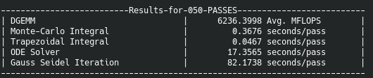

# HPPWB - High Performance Physics Workstation Benchmark

[For a PDF version of this README, run ```pandoc README.md -o README.pdf``` after cloning.]


## What?

HPPWB (High Performance Physics Workstation Benchmark) is an alternative suite for benchmarking workstations with specifically shared-memory architectures (for now).

## Why and How?

While industry standard benchmarks like HPL exist, which is used for making the TOP500 list, and is widely used across many domains, such benchmarks use a fixed workload like solving a dense set of linear equations to measure the performance of a system. While that provides a nice standard, it is generally not reflective of real-life performance in variety of workloads.

In specific simulations and workloads which are characterisitic to physics and engineering research, not only do we need to solve linear equations systems, but also other things like solving ODEs, PDEs and so on. We aim to tackle that problem with this suite &rarr; not only are we using solving linear equations as a benchmark but also things like performing integrals using Trapezoidal rule and the Monte-Carlo estimator, solving high-dimensional ODEs and BLAS routines. I aim to add more features and tests in the future along with acclerators and distributed-memory architecture support.

- **Benchmarks currently available:**

| Name and Description | Output | Interpretation |
|------|--------|----------------|
| DGEMM: $D=\alpha AB + \beta C$ where $A,B,C \in \mathbb{R}^{N\times N}$ and $\alpha,\beta \in \mathbb{R}$| MFLOPS (Millions of Floating Point Operations/second)| Higher the better|
| Monte-Carlo Integral: $\int_{0}^{1}4\frac{dx}{1+x^2}=\pi$| Time (in seconds)/pass | Lower the better |
| Direct Integral using Trapezoidal Rule: $\int_{0}^{1}4\frac{dx}{1+x^2}=\pi$| Time (in seconds)/pass | Lower the better |
| Solve high-dimensional ODE: $\dot{x}_i=\sum_j b_{ij}x_j + \sum_{ijk}a_{ijk}x_j x_k-x_i^3$ for $i=1,2,...,D$| Time (in seconds)/pass | Lower the better |
| Gauss-Seidel Iteration: Solve $AX=B$ where $A\in \mathbb{R}^{N\times N}$ and $X,B\in \mathbb{R}^{N\times 1}$| Time (in seconds)/pass | Lower the better |

## Compiling and Running

- **Install OpenMP, GNU Scientific Library and git, if not already installed.**
  
&rarr; For Ubuntu and it's derivatives, use the commands below. [These libraries are available for other distributions as well]

```console
sudo apt install libomp-dev
sudo apt install libgsl-dev
sudo apt install git
```

- **Clone the repository into a folder.**
  
```console
git clone https://github.com/dhrubajyoti98/HPPWB.git
```

- **Change into HPPWB and run "make" which should generate an executable ```hppwb_bench.run```.**
  
```console
cd HPPWB
make
```

&rarr; The compiler optimizations being passed to g++ are ```-Ofast``` and ```-march=native```.

- **Change the stack size to unlimited.**

```console
ulimit -s unlimited
```

&rarr; Not doing this step may show a segmentation fault.

- **Set the benchmark parameters and run the benchmark.**
  
```console
source bench_parameters.config && ./hppwb_bench.run <number of run-passes>
```

&rarr; If ```source``` does not work, use ```. bench_parameters.config && ./hppwb_bench.run <number of run-passes>```.

&rarr; ```<number of run-passes>``` **must** be greater than **5**.

&rarr; If you want to change the benchmark parameters, edit the ```bench_parameters.config``` file - the contents of the file are self-explanatory. The default values which are set can be viewed by running ```cat bench_parameters.config```.

```console
#!/bin/bash

#Do_not_edit_this_file_unless_you_know_what_you_are_doing.
#Changing_the_contents_of_this_file_might_change_the_output_values.

#ODE_system_and_Time_of_Solution_Details
export ODE_DIM=150
export ODE_TIME=10000

#Monte-Carlo_Integral_Details
export AVG_LENGTH=5000
export SAMP_LENGTH=5000

#DGEMM_Matrix_Multiplication_Details
export MATRIX_DIM=1000
export N_ITER=100

#Linear_Equation_Solution_Details_(error_limit_is_10^-5)
export LIN_DIM=1000
export MAX_ITER=1000000
export ERR_TOL=5

#Direct_Integral_Details
export COUNT=500000000
```

&rarr; To re-run the benchmark after changing the parameter values in the ```bench_parameters.config``` file, *there is no need to recomplie the source* - you can run the benchmark again directly.

&rarr; Separate benchmark parameter files can be generated and saved. All the environment variables declared in ```bench_parameters.config``` should be redefined in the corresponding file and the name of the file should be used in place of ```bench_parameters.config``` while running the benchmark.

## Sample Output

&rarr; Benchmark parameters used are the ones given in the previous section.

- Intel Core i9-10900K @3.7 GHz 10C 20T, 128 GB RAM, Ubuntu 20.04.3 LTS
  


- Intel Core i7-10700F @2.9 GHz 8C 16T, 32 GB RAM, Ubuntu 20.04.3 LTS
  


- Intel Xeon E-2146G @3.5 GHz 6C 12T, 64 GB RAM, Ubuntu 20.04.3 LTS
  


## Next Update

1. Add more benchmark test options.
2. Add GPU Compute Benchmark support.
3. Add Distributed-Memory support.

## Author and Contact

Dhrubajyoti Biswas, dhrubajyoti98@gmail.com
